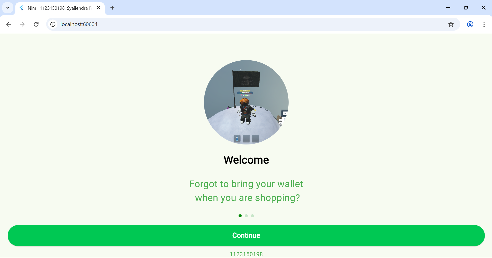
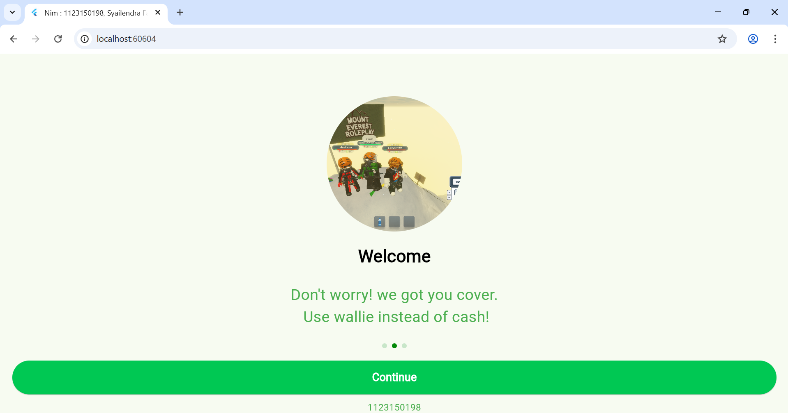
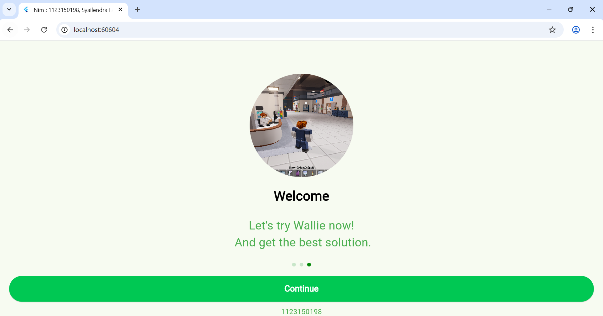
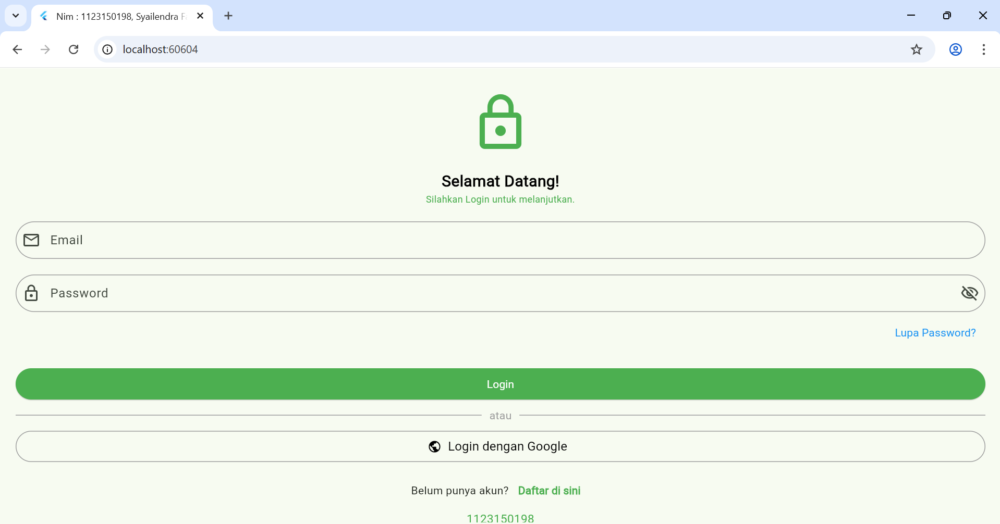
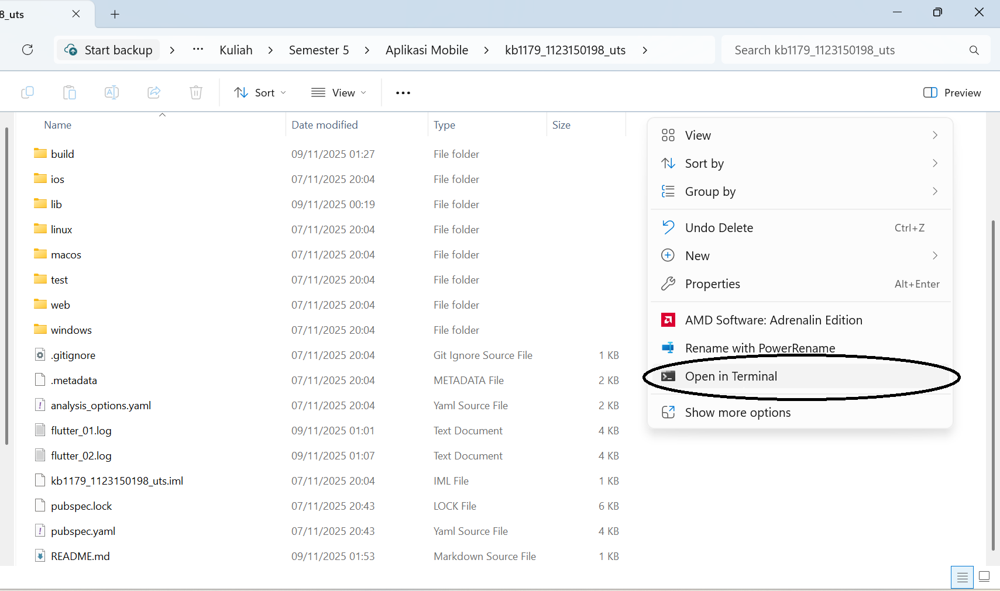

# Project UTS Aplikasi Mobile

## Hasil Screenshot
Berikut hasil tampilan aplikasi:

### Tampilan Desktop

---

## Nama Lengkap
**Syailendra Fas Faye**

## NIM
**1123150198**

---

## Cara Menjalankan Project
1. Buka folder project aplikasi
2. Klik kanan pada isi folder lalu buka terminal

3. Jalankan perintah di terminal: "flutter run"

## Thank You